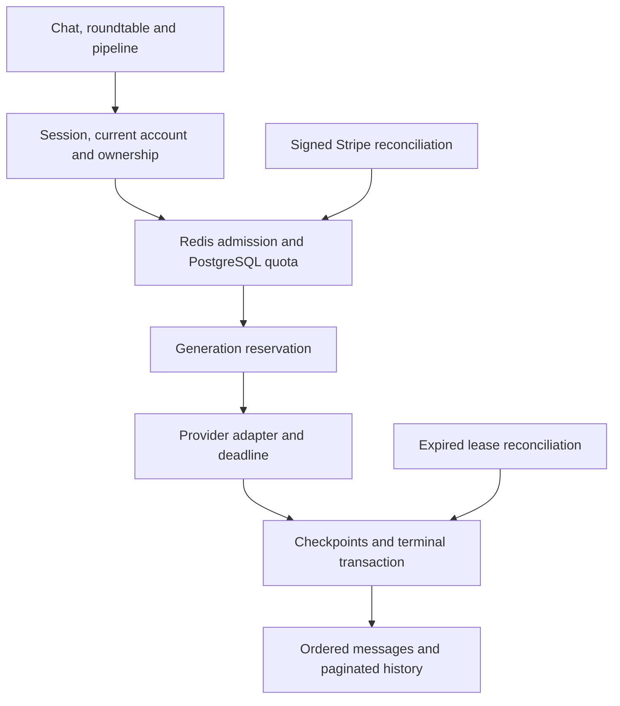

# Production completion map — September 8, 2026

Work branch: `codex/production-completion-20260907`.
Review: [draft PR #161](https://github.com/IAlready8/MultiLLM-Chat-Assistant/pull/161).
Baseline: `9818849639be29b5f8b25c5de9e1709f37ae91d5`.

The branch is published with explicit owner authorization. The connected GitHub API published trees identical to the local commits because shell Git lacked HTTPS credentials. Both local history and the remote branch's ancestry were preserved. No merge, production promotion or production database operation was performed.

## System map

Streaming validates the saved turn and reserves the generation before quota admission; completed replays bypass quota and provider dispatch. Native saved orchestration uses the same ownership/identity rules and persists each result independently. The optional Python sidecar remains limited to explicitly configured unsaved orchestration.

| Entity | Ownership and relationship | Purpose |
| --- | --- | --- |
| User, Account, Session | NextAuth account identity; APIs recheck current User | Authentication and account separation |
| Conversation → Message | User-owned; cascading deletion; ordered by turn/position | Prompt and response history |
| Generation → Message | User-owned; unique request identity; running lease | Replay fencing, status, token usage and checkpoints |
| LlmQuotaUsage | User-owned; independent of conversations | Atomic monthly admission; deletion cannot refund usage |
| ProviderConfig | User-owned; encrypted credentials on server | Provider settings and request configuration |
| Subscription | One per User; Stripe customer/subscription identifiers | Server-verified paid entitlement |
| StripeWebhookEvent | Unique event ID; same transaction as entitlement | Safe duplicate delivery and rollback |
| Goal, Persona, Team | Existing owned resources | Secondary workspace configuration |

## Implemented in this continuation

- Generation leases, first-chunk and periodic checkpoints, expiry reconciliation and a Bearer-authenticated cron route. Reconciliation preserves partial content and marks work interrupted; it never automatically repeats a potentially charged provider request. A late worker cannot overwrite an interrupted generation.
- Production rate limits require Redis and fail closed with a user-readable 503 if admission is unavailable. Initial connection is awaited, commands/connects have deadlines, and user configuration cannot increase server rate ceilings. Development memory fallback is bounded.
- Shared model context checks reserve output space using a conservative UTF-8 budget. Unsupported structured output, tools and attachments fail validation instead of being ignored. OpenAI reasoning/token parameters and modern Claude temperature/system-message handling were corrected against provider documentation. This is not proof of live model availability.
- Atomic PostgreSQL quotas, optional operator-supplied plan limits, actual Stripe price display/validation, cancellation and failed-payment UI states, and continued portal access for downgraded customers. Pro quota admission verifies current subscription status, configured price and paid period.
- Pipeline prompts and native model results persist with stable identities and replay protection. Roundtable uses durable streaming, retains completed transcripts and honors the requested turn count. Typing “2” after clearing the previous turn count no longer creates 22 paid turns.
- Cursor history in multi-chat, roundtable, pipeline and response comparison. Loaded items survive older-page failures. The legacy metadata-list endpoint is bounded to 100 records; active workspaces use 30-record pages with server limits of 1–100.
- Current-account API authorization, fresh admin allowlists, same-origin mutation checks, bounded JSON bodies, safer redirects and explicit provider-key update validation. See the [security audit](SECURITY_AUDIT_2026_09_08.md).
- Legacy local exports now use salted PBKDF2-SHA-256 plus AES-GCM, read older encrypted files, reject weak export passwords/oversized imports, allowlist restored preferences and use collision-resistant local conversation IDs. Their UI explicitly states that server conversations are not included.

## Verification evidence

[CI run 34188082260](https://github.com/IAlready8/MultiLLM-Chat-Assistant/actions/runs/34188082260) passed every job for published commit `4b84c6a65b2d170cf78177a460255f6dc1725286`:

- Node 22 dependency installation, TypeScript, zero-warning ESLint, 574 tests, coverage gates, security audits and production builds.
- Native PostgreSQL 16: all five migrations applied with `prisma migrate deploy`, followed by the production verifier and HTTP smoke checks.
- Redis 7: authenticated integration required distributed rate limiting and verified the connected/distributed diagnostic.
- Real credentials authentication and real HTTP/database behavior with a controlled external Ollama API: parallel success/failure, provider usage, reload order, replay, request conflicts, cross-account read/write/delete/dispatch denial, duplicate turns, regeneration, truncated streams, cancellation with partial persistence, lease recovery, concurrent quota admission, saved batch replay and deleted-account session denial.
- The quota race admitted exactly eight of nine concurrent attempts under an eight-unit allowance. Completed saved replays did not call the provider again or consume another quota unit.

The production HTTP smoke stage reported 19 passed, 0 failed and 13 skipped. Its credential/provider-specific checks were skipped when required configuration was absent; the separate authenticated integration exercised the controlled-provider lifecycle. These results do not establish paid-provider or Stripe-network success.

The final local follow-up passed 580 tests in 74 files, including pagination retry and real Node/WebCrypto encryption tests. The PR's latest checks are the authoritative gate for subsequent commits. Final coverage is 44% of lines, 74.83% of branches and 70.48% of functions; passing gates is not exhaustive coverage.

## Release contract and configuration

Apply migrations to a backed-up, explicitly selected staging database before using this version. This branch requires the existing initial migration plus:

1. `20260809000000_harden_stripe_subscription_state`
2. `20260907000000_durable_generations`
3. `20260908000000_generation_leases`
4. `20260908010000_llm_quota_usage`

Use `npm run verify:prod -- --apply-migrations`; it follows Prisma's production migration workflow. Do not reset a database or substitute `db push` for the migration history. Native CI proves empty-database application, not a restore rehearsal against production-sized data.

Required deployment inputs include `DATABASE_URL`, a stable auth secret and auth URL, `API_KEY_ENCRYPTION_SEED`, `REDIS_URL`, and `CRON_SECRET`. Configure authorized OAuth providers and user provider keys. Cron uses `Authorization: Bearer <CRON_SECRET>` and runs daily, with immediate lazy reconciliation when an owned conversation is opened.

For paid plans, configure Stripe API/price/webhook settings and **approved** `LLM_MONTHLY_REQUEST_LIMITS`. Its JSON contains `FREE`, `PRO` and `ENTERPRISE`; each value is a nonnegative integer or `null` for unlimited. An unset value intentionally does not invent commercial limits. Invalid configuration denies generation admission. One unit is one attempted provider generation, including failures/cancellations; periods reset at UTC calendar-month boundaries. Quota admission is not monetary invoicing, and stored `cost_usd: null` is not a zero-dollar charge.

## Current classification and remaining plan

| Phase | Current state | Next objective and work | Dependency |
| --- | --- | --- | --- |
| Staging/release | Native CI working; Vercel broken | Repair resource provisioning, migrate a dedicated staging DB, verify deployed SHA, callbacks, browser console and desktop/mobile critical paths | Working Vercel preview and staging configuration |
| Model contracts | Text/stream contracts working under controlled tests; live matrix unverified | Exercise every advertised provider/model, reasoning and long context; implement capability-aware tools, structured output and multimodal inputs | Authorized provider test credentials and supported model access |
| Paid product | Quota engine and lifecycle reconciliation implemented; commercial rules unset | Approve allowances/prices, configure Stripe test mode, run checkout/renewal/cancellation/past-due/redelivery scenarios and reconcile cost ledger | Plan rules and Stripe test configuration |
| Recovery/operations | Checkpoints and lease fencing implemented; staging scheduler unverified | Configure Redis/cron, exercise worker termination and outages in staging, monitor interruption backlog; add resumable job infrastructure only with safe provider semantics | Staging Redis, cron secret and observability |
| Accounts/workspaces | Durable core workspaces and pagination implemented; account lifecycle partial | Complete password recovery, profile/account management, server-history export/restore, message-level paging and responsive browser QA | Account/email policy and staging/browser access |

The inspected preview `dpl_32Rgykp8VPovWhZUiGWwqxuWS7S5` for commit `4b84c6a` failed before application build with the same resource-provisioning failure seen on the preceding commits. Available Vercel tools expose deployment state/logs but not the failing integration resource's configuration. No provider credentials, Stripe test settings or Vercel token are available in this execution environment. Modified authenticated UI has interaction-test coverage but has **not** passed deployed browser QA. The application is materially closer to release, but is not production-ready yet.

## Documentation consulted

- [OpenAI Chat Completions contract](https://developers.openai.com/api/reference/resources/chat/subresources/completions/methods/create)
- [GPT-6 Astra model contract](https://developers.openai.com/api/docs/models/gpt-6-astra)
- [Anthropic Messages contract](https://platform.claude.com/docs/en/api/messages/create)
- [Redis production client guidance](https://redis.io/docs/latest/develop/clients/nodejs/produsage/)
- [Vercel cron authentication](https://vercel.com/docs/cron-jobs/manage-cron-jobs)
- [Stripe Price object](https://docs.stripe.com/api/prices/object), [currency units](https://docs.stripe.com/currencies)
